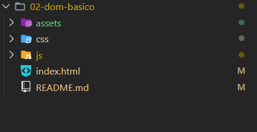
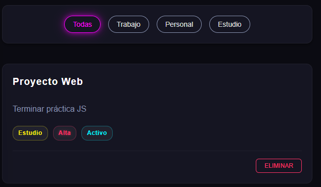
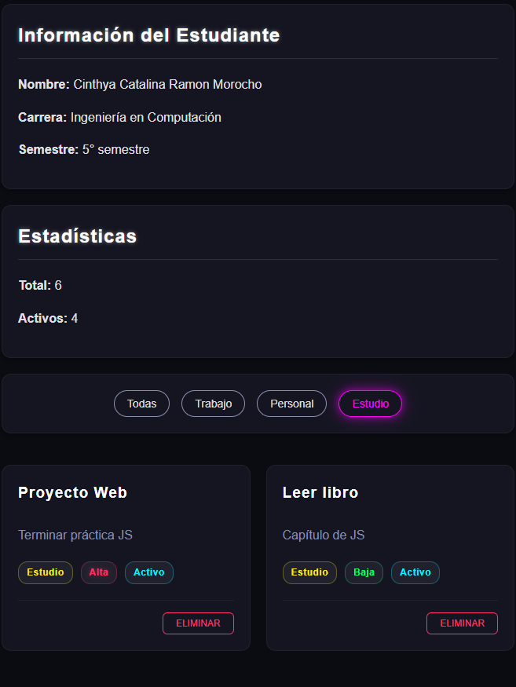

# Práctica 2: Manipulacion del DOM

## Datos del Estudiante
- **Nombre:** Cinthya Catalina Ramon Morocho
- **Curso:** Programación y Plataformas Web
- **Fecha:** *21-04-2026*

---

## 1. Introduccion 

El DOM (Document Object Model) permite a JavaScript interactuar con la estructura de una página web en tiempo real. A través del DOM, es posible seleccionar, modificar, crear y eliminar elementos HTML sin recargar la página.


## 2. Estructura del Proyecto

        /02-dom-basico
        ├── index.html
        ├── css/
        │ └── styles.css
        ├── js/
        │ └── app.js
        ├── assets/
        │ ├── p2-1.png
        │ ├── p2-2.png
        │ ├── p2-3.png
        │ └── p2-4.png
        └── README.md

## 3. Funcionalidades Implementadas

- Visualización de información del estudiante
- Renderizado dinámico de tarjetas
- Eliminación de elementos
- Filtrado por categoría
- Actualización de estadísticas en tiempo real

## 4. Código Relevante

### 4.1 Mostrar información del estudiante

```javascript
function mostrarInfoEstudiante() {
  document.getElementById('estudiante-nombre').textContent = estudiante.nombre;
  document.getElementById('estudiante-carrera').textContent = estudiante.carrera;
  document.getElementById('estudiante-semestre').textContent = `${estudiante.semestre}° semestre`;
}
```
*Descripción:*

Se actualizan dinámicamente los datos del estudiante utilizando textContent, evitando problemas de seguridad.

### 4.2 Renderizado de tarjetas

```javascript 
function renderizarLista(datos) {
  const contenedor = document.getElementById('contenedor-lista');
  contenedor.innerHTML = '';

  datos.forEach(el => {
    const card = document.createElement('div');
    card.classList.add('card');

    const titulo = document.createElement('h3');
    titulo.textContent = el.titulo;

    const descripcion = document.createElement('p');
    descripcion.textContent = el.descripcion;

    const btnEliminar = document.createElement('button');
    btnEliminar.textContent = 'Eliminar';

    btnEliminar.addEventListener('click', () => {
      eliminarElemento(el.id);
    });

    card.appendChild(titulo);
    card.appendChild(descripcion);
    card.appendChild(btnEliminar);

    contenedor.appendChild(card);
  });
}
```

*Descripción:*

Se actualizan dinámicamente los datos del estudiante utilizando textContent, evitando problemas de seguridad.


### 4.3 Eliminación de elementos

```javascript
function eliminarElemento(id) {
  const index = elementos.findIndex(el => el.id === id);
  if (index !== -1) {
    elementos.splice(index, 1);
    renderizarLista(elementos);
  }
}


```

*Descripción:*
Se elimina un elemento del arreglo y se vuelve a renderizar la lista.


### 4.4 Filtrado de elementos
```javascript
function inicializarFiltros() {
  const botones = document.querySelectorAll('.btn-filtro');

  botones.forEach(btn => {
    btn.addEventListener('click', () => {
      const categoria = btn.dataset.categoria;

      document.querySelectorAll('.btn-filtro')
        .forEach(b => b.classList.remove('btn-filtro-activo'));

      btn.classList.add('btn-filtro-activo');

      if (categoria === 'todas') {
        renderizarLista(elementos);
      } else {
        const filtrados = elementos.filter(e => e.categoria === categoria);
        renderizarLista(filtrados);
      }
    });
  });
}


```
*Descripción:*
Permite filtrar los elementos por categoría utilizando eventos y el método .filter().

## 5. Evidencias


1. Estructura del proyecto

**Descripcion:** Estructura de carpetas y demas 


2. Información del estudiante


**Descripcion:** Datos del estudiante. 

3. Estadísticas


**Descripción**: Se visualiza el total de elementos y los elementos activos, actualizándose en tiempo real.

4. Filtros y lista



**Descripción**: Se presentan los botones de filtrado por categoría y la lista de tarjetas generadas dinámicamente.

5. Vista general



**Descripción**: Vista completa de la aplicación funcionando, incluyendo tarjetas, filtros y estilos aplicados.