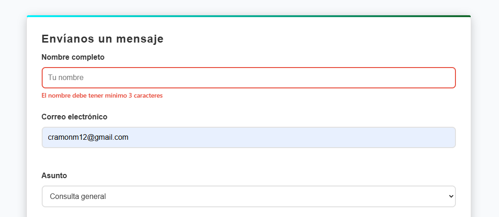
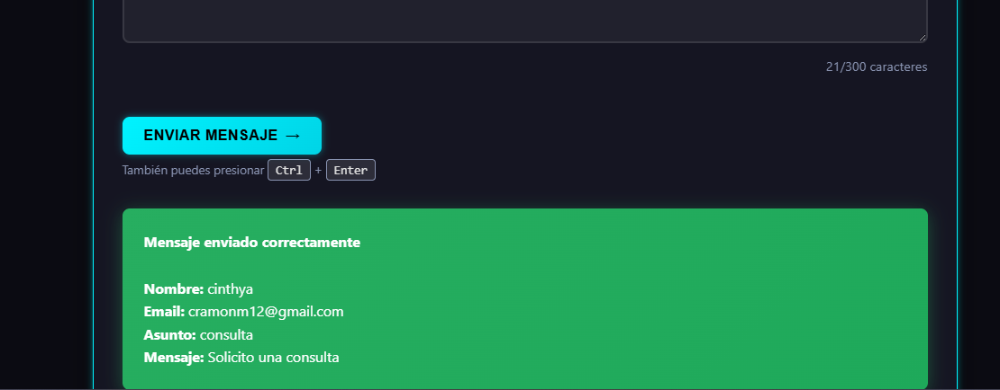
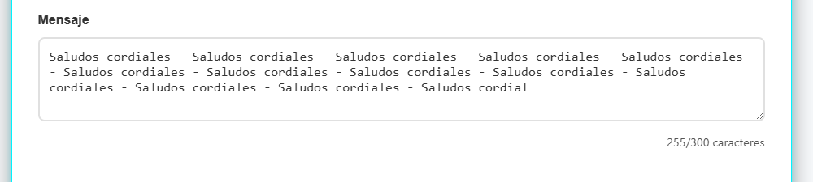
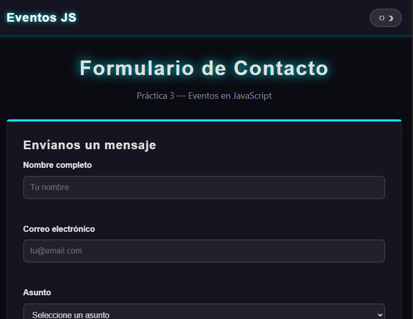
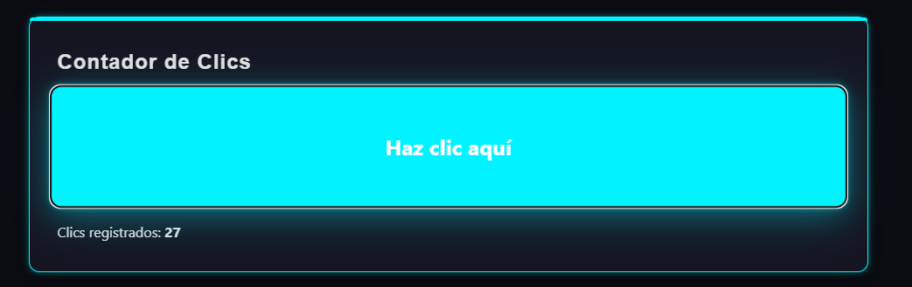
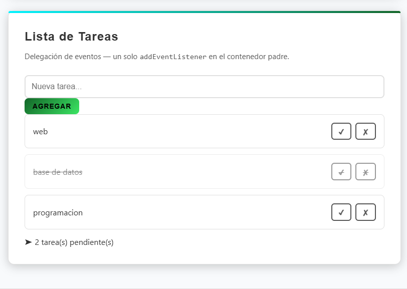
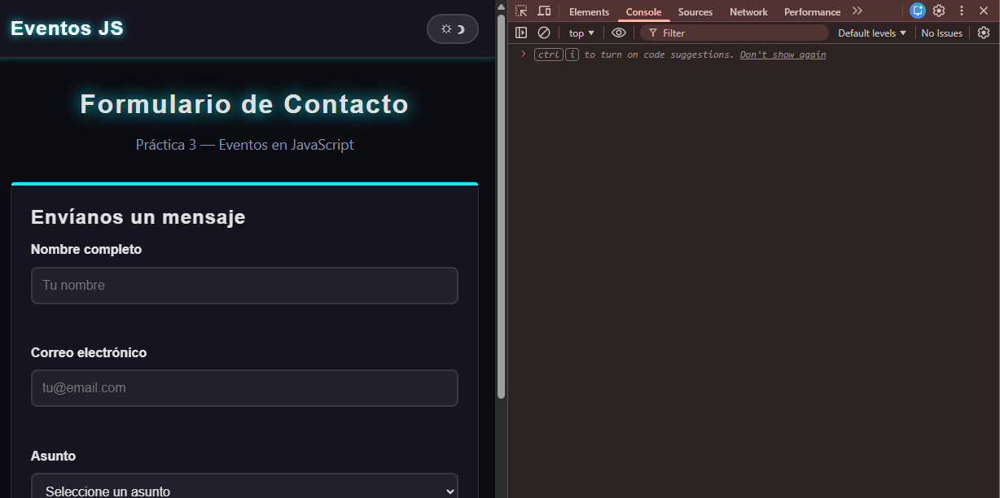

# Práctica 3: Eventos en JavaScript

## Datos del Estudiante
- **Nombre:** Cinthya Catalina Ramon Morocho
- **Curso:** Programación y Plataformas Web
- **Fecha:** 21/04/2026

---

## Descripción

Práctica enfocada en el manejo de **eventos en JavaScript** mediante `addEventListener`. Se implementó un formulario de contacto con validación en tiempo real, modo oscuro/claro, atajo de teclado, contador de clics y una lista de tareas usando **delegación de eventos**.

---

## Estructura del Proyecto

```

 /practica-03/
        ├── index.html
        ├── css/
        │ └── styles.css
        ├── js/
        │ └── app.js
        ├── assets
        └── README.md

```

---

## Funcionalidades Implementadas

| N° | Funcionalidad | Evento(s) usado(s) |
|----|--------------|-------------------|
| 1 | Formulario de contacto con validación | `submit`, `blur`, `input` |
| 2 | Contador de caracteres en textarea | `input` |
| 3 | Validación visual en tiempo real | `blur`, `input` |
| 4 | Focus en primer campo inválido | `submit` |
| 5 | Modo oscuro / claro | `click` |
| 6 | Atajo de teclado `Ctrl + Enter` | `keydown` |
| 7 | Contador de clics interactivo | `click`, `keydown` |
| 8 | Lista de tareas (agregar) | `click`, `keydown` |
| 9 | Lista de tareas (completar/eliminar) | `click` — **delegación** |

---

## Evidencias

### 1. Formulario con validación de errores


**Descripción:** Se muestran los errores visuales (borde rojo y mensaje) cuando los campos son inválidos. La validación se activa con el evento `blur` al salir de cada campo y también en el `submit`.

---

### 2. Formulario enviado correctamente



**Descripción:** Al pasar todas las validaciones, se muestra un bloque verde con los datos ingresados por el usuario. El formulario se reinicia automáticamente.

---

### 3. Contador de caracteres en tiempo real


**Descripción:** El contador debajo del textarea se actualiza con cada tecla usando el evento `input`.

---

### 4. Modo oscuro / claro


**Descripción:** Botón en el header alterna la clase `.dark` en el `body` usando `classList.toggle()`. 

---

### 5. Contador de clics interactivo


**Descripción:** Al hacer clic en la zona morada, el contador incrementa y muestra una pequeña animación en el número. También funciona con teclado (`Enter` / `Space`).

---

### 6. Lista de tareas — Event Delegation


**Descripción:** Se usa **un solo** `addEventListener` en el elemento `<ul id="tareas">`. Mediante `e.target.dataset.action` y `e.target.closest('li')` se identifican las acciones de completar y eliminar en cualquier elemento de la lista, incluyendo los agregados dinámicamente.

---

### 7. Consola sin errores


**Descripción:** DevTools sin errores ni advertencias. Se utilizó `'use strict'` y verificaciones de null antes de manipular elementos.

---

