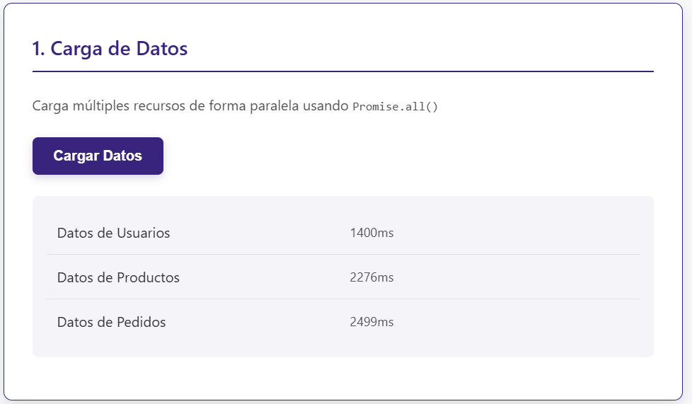
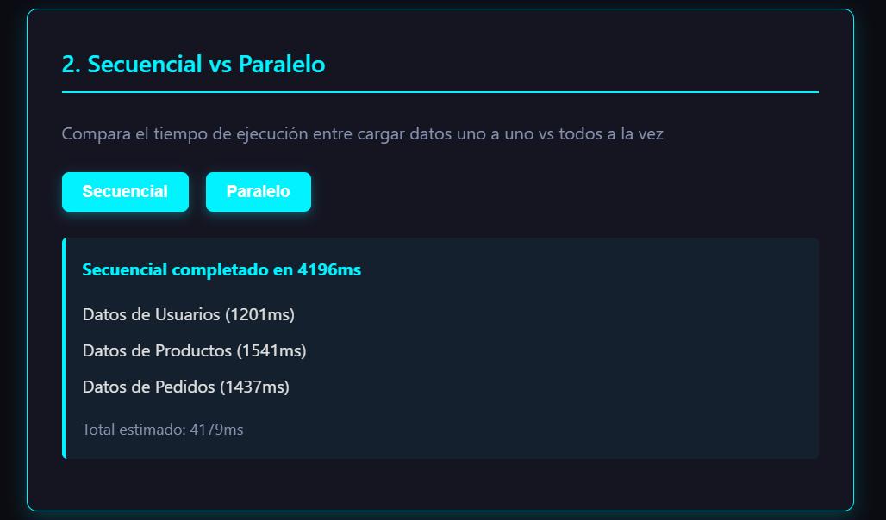
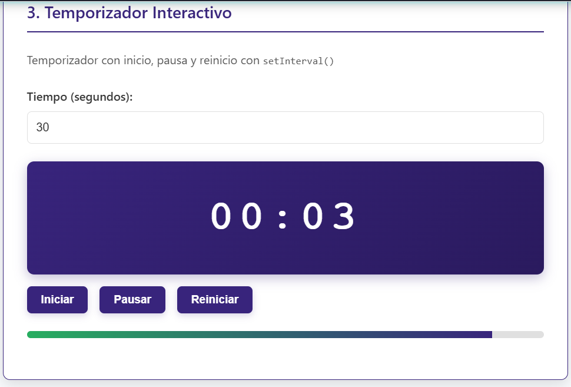
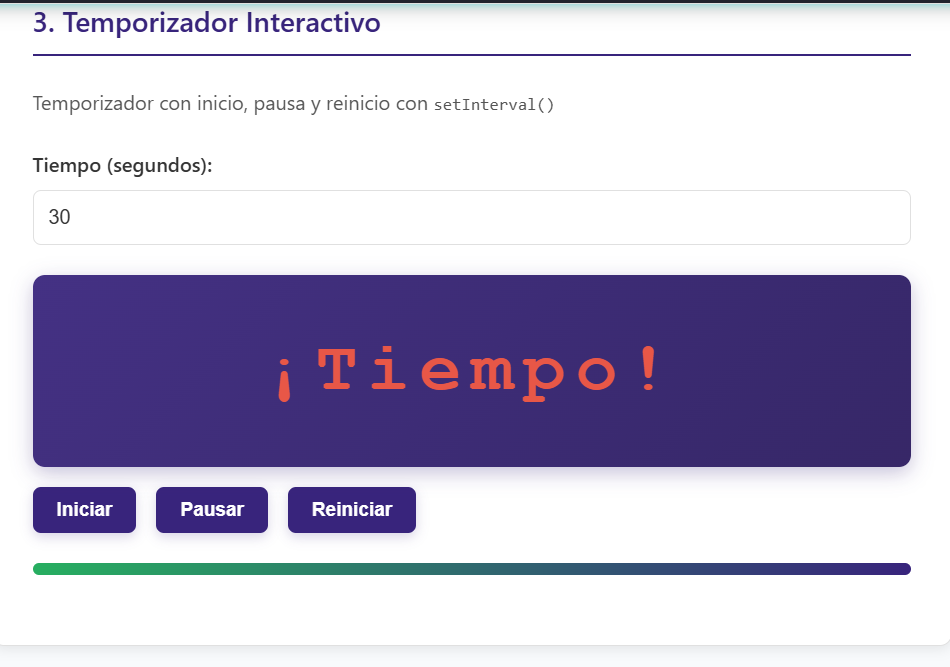
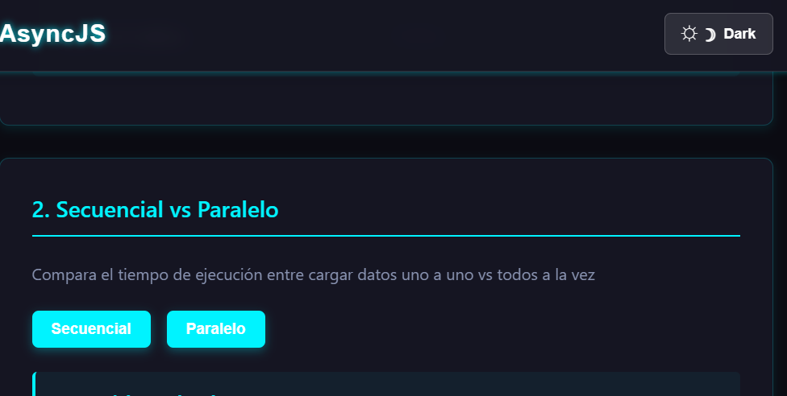
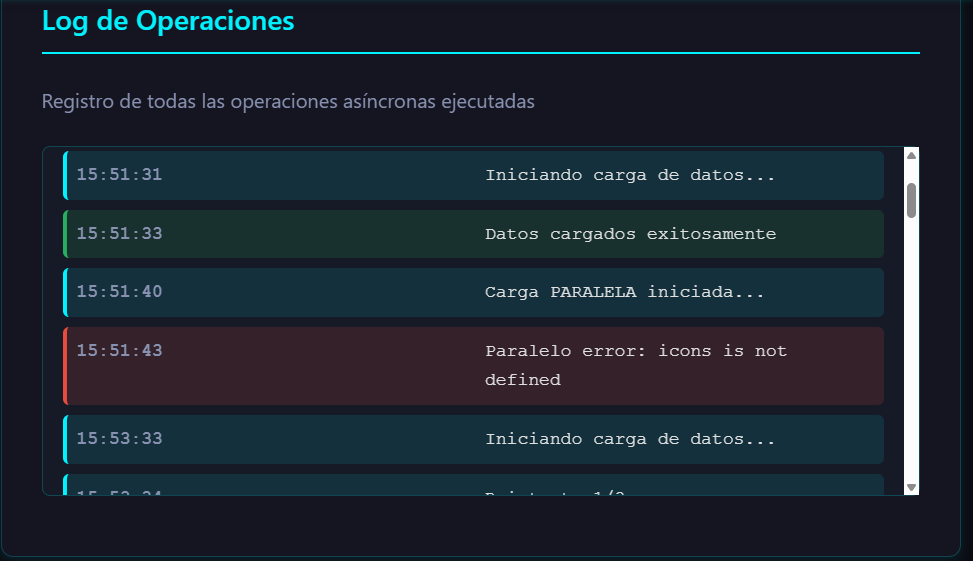
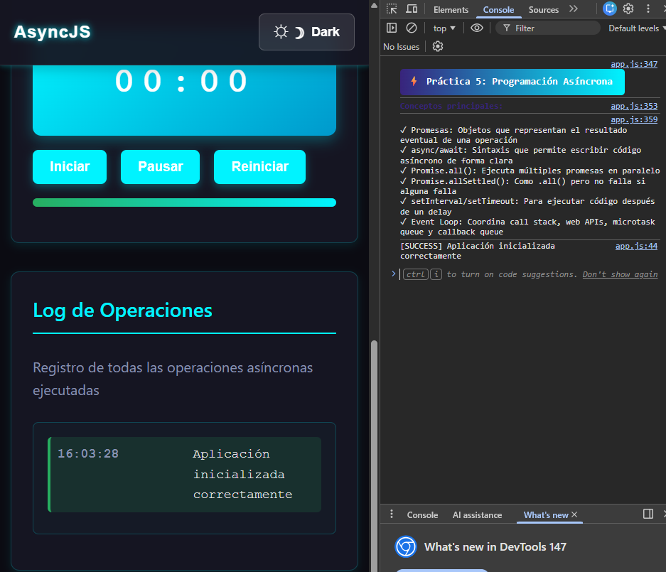

# Práctica 5: Programación Asíncrona en JavaScript

## Datos del Estudiante
- **Nombre:** Cinthya Catalina Ramon Morocho
- **Curso:** Programación y Plataformas Web
- **Fecha:** *21-04-2026*

---
## Descripción

Implementación de una aplicación para gestionar operaciones asíncronas en JavaScript. Se aplicaron conceptos de Event Loop, Promesas y async/await para mejorar la fluidez de la interfaz de usuario.
---

## Estructura del Proyecto

```
/practica-05/
    ├── index.html
    ├── styles.css
    ├── app.js
    └── README.md
```

---


## Código Destacado

### 1. Comparativa de Ejecución

Para optimizar el rendimiento, se comparó la ejecución secuencial (lenta) frente a la paralela (rápida):

```javascript

const [usuarios, productos, pedidos] = await Promise.all([
    simularPeticion('Usuarios'),
    simularPeticion('Productos'),
    simularPeticion('Pedidos')
]);
```


---

### 2. Manejo de Errores y Reintentos

Se implementó una función para evitar que la aplicación falle ante caídas de red simuladas:

```javascript
try {
    // Intenta cargar datos con hasta 3 reintentos
    await fetchConReintentos(() => simularPeticion('Datos')); 
} catch (error) {
    mostrarEstado(`Error definitivo: ${error.message}`, 'error');
}
```

**Descripción:** `await` pausa la ejecución de esta función hasta que se resuelva la promesa. `async` indica que la función siempre retorna una promesa.

---


### 3. Comparación Secuencial vs Paralelo

**Secuencial (Lento):**
```javascript
const inicio = performance.now();
const usuarios = await simularPeticion('Usuarios');     // ~1.5s
const productos = await simularPeticion('Productos');   // ~2.0s
const pedidos = await simularPeticion('Pedidos');       // ~1.0s
const total = performance.now() - inicio;               // ~4.5s total
```

**Paralelo (Rápido):**
```javascript
const inicio = performance.now();
const resultados = await Promise.allSettled([
    simularPeticion('Usuarios'),     // ~1.5s
    simularPeticion('Productos'),    // ~2.0s
    simularPeticion('Pedidos')       // ~1.0s
]);                                  // ~2.0s total (máximo)
const total = performance.now() - inicio;
```

**Mejora:** 2.5s ahorrados (~55% más rápido) ⚡


## Evidencias Principales

### 1. Carga de Datos con Spinner


**Descripción:** Se muestra el spinner mientras se cargan los 3 recursos en paralelo. 
---

### 2. Datos Cargados Exitosamente



**Descripción:** Los tres recursos se cargaron exitosamente mostrando nombre y tiempo de carga individual. El log inferior registra todas las operaciones.

---

### 3. Comparación Secuencial vs Paralelo



**Descripción:** 
- **Secuencial:** ~5-7 segundos (suma de todos)
- **Paralelo:** ~2-3 segundos (máximo individual)
- Diferencia visible del paralelismo: ~2-3 segundos ahorrados 

---

### 4. Temporizador Iniciado



**Descripción:** Display muestra 00:30, barra de progreso comienza a avanzar. El contador disminuye cada segundo.

---

### 5. Temporizador Terminado



**Descripción:** Cuando llega a 00:00, el display muestra "¡Tiempo!" en rojo con animación pulse. Log registra el evento.

---

### 6. Modo Oscuro Activo



**Descripción:** Tema cyberpunk con fondo oscuro, acentos neon y transiciones suaves. Preferencia guardada en localStorage.

---

### 7. Log de Operaciones Detallado



**Descripción:** Registro cronológico de operaciones asincrónicas con colores diferenciados:
- 🟢 Verde: Éxito
- 🔴 Rojo: Error
- 🔵 Azul: Información

---

### 8. Consola sin Errores



**Descripción:** DevTools mostrando ejecución correcta sin errores. Se utilizó `'use strict'` y validaciones de null.

La carga paralela mediante Promise.all() resultó ser ~2.5 segundos más rápida que la secuencial en las pruebas realizadas, validando la importancia de la asincronía para la experiencia de usuario (UX).